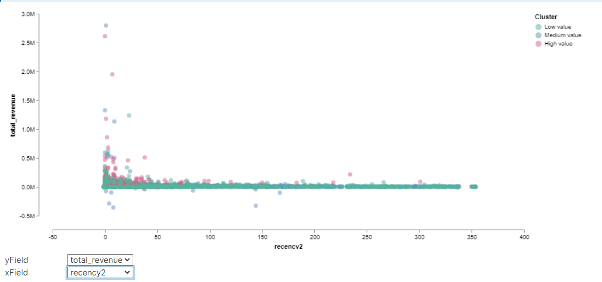

# Customer Segmentation

## Segmentation by RFM clustering

**Introduction**

This series of articles was designed to explain how to use Kibana with the help of Python in a simplistic way to fuel your company’s growth by applying the predictive approach to all your actions. It will be a combination of programming, data analysis, and machine learning.

# Part 2: Customer Segmentation

In the  [previous article](README.md), we have analyzed the major metrics for our online retail business. Now we know what and how to track by using Kibana. It’s time to focus on customers and segment them.

But first off, why we do segmentation?

Because you can’t treat every customer the same way with the same content, same channel, same importance. They will find another option which understands them better.

Customers who use your platform have different needs and they have their own different profile. Your should adapt your actions depending on that.

You can do many different segmentations according to what you are trying to achieve. If you want to increase retention rate, you can do a segmentation based on churn probability and take actions. But there are very common and useful segmentation methods as well. Now we are going to implement one of them to our business:  **RFM.**

**RFM** stands for Recency - Frequency - Monetary Value. Theoretically we will have segments like below:

-   **Low Value**: Customers who are less active than others, not very frequent buyer/visitor and generates very low - zero - maybe negative revenue.
-   **Mid Value**: In the middle of everything. Often using our platform (but not as much as our High Values), fairly frequent and generates moderate revenue.
-   **High Value**: The group we don’t want to lose. High Revenue, Frequency and low Inactivity.

As the methodology, we need to calculate  _Recency, Frequency and Monetary Value_  (we will call it Revenue from now on) and apply  _unsupervised machine learning_  to identify different groups (clusters) for each. Let’s jump into coding and see how to do **RFM Clustering**.

## Recency

To calculate recency, we need to find out most recent purchase date of each customer and see how many days they are inactive for. After having no. of inactive days for each customer, we will apply K-means* clustering to assign customers a  _recency score_.

For this example, we will continue using same dataset which can be found  [here](https://github.com/synapticielfactory/eland_es_analytics/blob/master/invoices.7z). Before jumping into recency calculation, let’s recap the data work we’ve done before.

Now we can calculate recency:

Our index **es-invoices-customers** contains **last_invoice** from which we can deduce recency score.

First, we mark the last invoice in our interested time range that is the last 365 days. For this, we create a new transformation **es-customers-statistics** :
```json
PUT _transform/es-customers-statistics
{
  "id": "es-customers-statistics",
  "source": {
    "index": [
      "es-invoices-customers"
    ],
    "query": {
      "range": {
        "last_invoice": {
          "gte": "now-365d/d",
          "lt": "now/d"
        }
      }
    }
  },
  "dest": {
    "index": "es-customers-statistics"
  },
  "pivot": {
    "group_by": {
      "date": {
        "date_histogram": {
          "field": "last_invoice",
          "fixed_interval": "365d"
        }
      }
    },
    "aggregations": {
      "latest_invoice": {
        "max": {
          "field": "last_invoice"
        }
      }
    }
  }
}
```
we can run it with the following call : 
```json
POST _transform/es-customers-statistics/_start
```
Then, we enrich the **lastest_invoice** into the active customers in our time range. To do so, we use enrich policy as the following : 
```json
PUT /_enrich/policy/customers_latest_invoice
{
  "match": {
    "indices": "es-customers-statistics",
    "match_field": "date",
    "enrich_fields": [
      "latest_invoice"
    ]
  }
}
```
As well, it can be run with the command below : 
```json
POST /_enrich/policy/customers_latest_invoice/_execute
```
Finally, we use ingest functionality to get the recency score for each active customers in our range time :
```json
PUT /_ingest/pipeline/customer_lookup
{
  "description": "",
  "processors": [
    {
      "script": {
        "lang": "painless",
        "source": "ZonedDateTime zdt = ZonedDateTime.parse(ctx.last_invoice); ctx.date = (long) Math.floor(zdt.toInstant().toEpochMilli() / params.interval) * params.interval",
        "params": {
          "interval": 31536000000 // 365 * 24 * 3600 * 10000
        }
      }
    },
    {
      "enrich": {
        "policy_name": "customers_latest_invoice",
        "field": "date",
        "target_field": "enrich",
        "max_matches": 1
      }
    },
    {
      "rename": {
        "field": "enrich.latest_invoice",
        "target_field": "latest_invoice",
        "ignore_failure": true
      }
    },
    {
      "remove": {
        "field": "enrich",
        "ignore_failure": true
      }
    },
    {
      "script": {
        "lang": "painless",
        "source": "if(ctx.latest_invoice == null) { ctx.recency = -1; } else { ctx.recency = (ZonedDateTime.parse(ctx.latest_invoice).toInstant().toEpochMilli() - ZonedDateTime.parse(ctx.last_invoice).toInstant().toEpochMilli())/ 24 / 3600 / 1000; }"
      }
    },
    {
      "script": {
        "lang": "painless",
        "source": "double mean(def arr) { double total = 0; for(int i=0; i<arr.length; i++){ total = total + arr[i]; } total / arr.length; } if(ctx.recency != null ) {ctx.score = mean(new double[] {ctx.recency, ctx.count_orders, ctx.total_revenue});}"
      }
    }
  ]
}
```
To get the result, we run the ingest with the command below: 
```json
POST es-invoices-customers/_update_by_query?pipeline=customer_lookup
{
  "query": {
    "match_all": {}
  }
}
```
Our index **es-invoices-customers**  contains recency data now:
```json
GET es-invoices-customers/_search
{
  "query": {
    "range": {
      "last_invoice": {
        "gte": "now-365d/d",
        "lt": "now/d"
      }
    }
  }
}
```
```json
{
  "took" : 80,
  "timed_out" : false,
  "_shards" : {
    "total" : 1,
    "successful" : 1,
    "skipped" : 0,
    "failed" : 0
  },
  "hits" : {
    "total" : {
      "value" : 2138,
      "relation" : "eq"
    },
    "max_score" : 1.0,
    "hits" : [
      {
        "_index" : "es-invoices-customers",
        "_type" : "_doc",
        "_id" : "MawpT5q-8qYGhSR1nOT0lVUAAAAAAAAA",
        "_score" : 1.0,
        "_source" : {
          "date" : 1545264000000,
          "quantity" : 2458.0,
          "latest_invoice" : "2019-12-09T12:50:00.000Z",
          "avg_revenue" : 236.81318719046456,
          "recency" : 1,
          "first_invoice" : "2018-12-07T14:57:00.000Z",
          "score" : 14427.66668955485,
          "total_revenue" : 43100.00006866455,
          "count_orders" : 182.0,
          "last_invoice" : "2019-12-07T15:52:00.000Z",
          "customer_id" : "12347"
        }
      },
      {
        "_index" : "es-invoices-customers",
        "_type" : "_doc",
        "_id" : "MZ3YTjnl1J-LoiLTtY2f42kAAAAAAAAA",
        "_score" : 1.0,
        "_source" : {
          "date" : 1545264000000,
          "quantity" : 631.0,
          "latest_invoice" : "2019-12-09T12:50:00.000Z",
          "avg_revenue" : 240.76027407711499,
          "recency" : 18,
          "first_invoice" : "2019-11-21T09:51:00.000Z",
          "score" : 5888.833335876465,
          "total_revenue" : 17575.500007629395,
          "count_orders" : 73.0,
          "last_invoice" : "2019-11-21T09:51:00.000Z",
          "customer_id" : "12349"
        }
      },
      ...
   ]
}
```
To get a snapshot about how recency looks like, we can use **stats** aggregation. It shows min, max, count and average. we can also use **boxplot** aggregation for percentiles of our data.
```json
GET es-invoices-customers/_search
{
  "size": 0,
    "query": {
    "range": {
      "last_invoice": {
        "gte": "now-365d/d",
        "lt": "now/d"
      }
    }
  },
  "aggs": {
    "recency_stats": {
      "stats": {
        "field": "recency"
      }
    },
    "recency_boxplot": {
      "boxplot": {
        "field": "recency" 
      }
    }
  }
}
```
```json
{
  "took" : 6,
  "timed_out" : false,
  "_shards" : {
    "total" : 1,
    "successful" : 1,
    "skipped" : 0,
    "failed" : 0
  },
  "hits" : {
    "total" : {
      "value" : 4241,
      "relation" : "eq"
    },
    "max_score" : null,
    "hits" : [ ]
  },
  "aggregations" : {
    "recency_stats" : {
      "count" : 4241,
      "min" : 0.0,
      "max" : 323.0,
      "avg" : 72.33529827870785,
      "sum" : 306774.0
    },
    "recency_boxplot" : {
      "min" : 0.0,
      "max" : 323.0,
      "q1" : 12.160119047619046,
      "q2" : 37.142857142857146,
      "q3" : 102.38425609478242
    }
  }
}
```
We see that even though the average is 72 day recency, median is 37.
We can quickly make a histogram  to see how is the distribution of recency across our customers using Kibana's **vertical bar** visualization as below.


For clustering part, we will switch to pandas. First we need to load our index into environment:
```python
# import eland official API
# check it on https://github.com/elastic/eland
import eland as ed

# other imports
import pandas as pd
import matplotlib.pyplot as plt

# import elasticsearch-py client
from elasticsearch import Elasticsearch

# Function for pretty-printing JSON
def json(raw):
    import json
    print(json.dumps(raw, indent=2, sort_keys=True))
```
```python
# Connect to an Elasticsearch instance
# here we use the official Elastic Python client
# check it on https://github.com/elastic/elasticsearch-py
es = Elasticsearch(
  ['http://localhost:9200'],
  http_auth=("elastic", "changeme")
)
# print the connection object info (same as visiting http://localhost:9200)
# make sure your elasticsearch node/cluster respond to requests
json(es.info())
```
```python
ed_invoices = ed.DataFrame(es, 'es-invoices-customers')
ed_invoices.head(5)
```
We will use K-means clustering to assign a recency score. But we should tell how many clusters we need to K-means algorithm. To find it out, we will apply Elbow Method. Elbow Method simply tells the optimal cluster number for optimal inertia.

Before going into clustering we need to convert our DataFrame to Pandas:
```python
ed_users = ed.eland_to_pandas(ed_invoices.filter(['customer_id','recency','count_orders','total_revenue','score']))
ed_users.head(5)
```
Then we can go with the code snippet and Inertia graph are as follows: : 
```python
from sklearn.cluster import KMeans
ed_recency = ed_users.filter(['customer_id','recency'])
sse={}
for k in range(1, 10):
    kmeans = KMeans(n_clusters=k, max_iter=1000).fit(ed_recency )
    sse[k] = kmeans.inertia_ 
    
plt.figure()
plt.plot(list(sse.keys()), list(sse.values()))
plt.xlabel("Number of cluster")
plt.show()
```

Inertia graph:


Here it looks like 3 is the optimal one. Based on business requirements, we can go ahead with less or more clusters. We will be selecting 4 for this example:

We have calculated clusters and assigned them to each Customer in our dataframe  **ed_recency**.
```python
#build 4 clusters for recency and add it to dataframe
kmeans = KMeans(n_clusters=4)
kmeans.fit(ed_recency)
ed_users['RecencyCluster'] = kmeans.predict(ed_recency)
ed_users.groupby('RecencyCluster')['recency'].describe()
```


We can see how our recency clusters have different characteristics. The customers in Cluster 1 are very recent compared to Cluster 2.

```python
#function for ordering cluster numbers
def order_cluster(cluster_field_name, target_field_name,df,ascending):
    new_cluster_field_name = 'new_' + cluster_field_name
    df_new = df.groupby(cluster_field_name)[target_field_name].mean().reset_index()
    df_new = df_new.sort_values(by=target_field_name,ascending=ascending).reset_index(drop=True)
    df_new['index'] = df_new.index
    df_final = pd.merge(df,df_new[[cluster_field_name,'index']], on=cluster_field_name)
    df_final = df_final.drop([cluster_field_name],axis=1)
    df_final = df_final.rename(columns={"index":cluster_field_name})
    return df_final

ed_users = order_cluster('RecencyCluster', 'recency',ed_users,False)
ed_users.groupby('RecencyCluster')['recency'].describe()
```
We have added one function to our code which is  **order_cluster()**. K-means assigns clusters as numbers but not in an ordered way. We can’t say cluster 0 is the worst and cluster 4 is the best. order_cluster() method does this for us and our new dataframe looks much neater:


Great! 3 covers most recent customers whereas 0 has the most inactive ones.

Let’s apply same for Frequency and Revenue.

**Frequency**

To create frequency clusters, we need to find total number orders for each customer. First calculate this and see how frequency look like in our customer database:


Apply the same logic for having frequency clusters and assign this to each customer:

Characteristics of our frequency clusters look like below:


As the same notation as recency clusters, high frequency number indicates better customers.

## Revenue

Let’s see how our customer database looks like when we cluster them based on revenue. We will calculate revenue for each customer, plot a histogram and apply the same clustering method.


We have some customers with negative revenue as well. Let’s continue and apply k-means clustering:


## Overall Score

Awesome! We have scores (cluster numbers) for recency, frequency & revenue. Let’s create an overall score out of them:
```python
#calculate overall score and use mean() to see details
ed_users['OverallScore'] = ed_users['RecencyCluster'] + ed_users['FrequencyCluster'] + ed_users['RevenueCluster']
score = ed_users.groupby('OverallScore')['recency','count_orders','total_revenue'].mean()
score
```

Let's send the result to Elastic for further analysis :

```python
ett = ed_users.filter(['OverallScore','recency','count_orders','total_revenue'])
edd = ed.pandas_to_eland(ett,es,"es-customers-clusters")
edd
```


The scoring above clearly shows us that customers with score 8 is our best customers whereas 0 is the worst.

To keep things simple, better we name these scores:

-   0 to 2: Low Value
-   3 to 4: Mid Value
-   5+: High Value

We can easily apply this naming in Vega visualization:
```json
{
  "$schema": "https://vega.github.io/schema/vega/v4.json",
  "description": "A scatter plot of film statistics, with null values visualized along the axes.",
  "width": 800,
  "height": 400,
  "padding": 5,
  "autosize": {"type": "fit-y", "resize": true},
  "signals": [
    {
      "name": "yField",
      "value": "recency",
      "bind": {
        "input": "select",
        "options": ["recency", "count_orders", "total_revenue"]
      }
    },
    {
      "name": "xField",
      "value": "count_orders",
      "bind": {
        "input": "select",
        "options": ["count_orders", "recency", "total_revenue"]
      }
    },
    {"name": "nullSize", "value": 8},
    {"name": "nullGap", "update": "nullSize + 10"}
  ],
  "data": [
    {
      "name": "clusters",
      "url": {"index": "es-customers-clusters", "body": { "size": 10000 }},
      "format": {"property": "hits.hits"}
    },
    {
      "name": "rfm",
      "source": "clusters",
      "transform": [
        {
          "type": "project",
          "fields": [
            "_source.recency",
            "_source.count_orders",
            "_source.total_revenue",
            "_source.OverallScore"
          ],
          "as": ["recency", "count_orders", "total_revenue", "OverallScore"]
        }
      ]
    },
    {
    "name": "score",
    "source": "rfm",
          "transform": [
        {
          "type": "formula",
          "expr": "datum.OverallScore > 5 ? 3 : datum.OverallScore > 2 ? 2 : 1",
          "as":   "type"
        }
      ]
    }
    ,
    {
      "name": "valid",
      "source": "score",
      "transform": [
        {
          "type": "filter",
          "expr": "datum[xField] != null && datum[yField] != null"
        }
      ]
    },
        {
      "name": "clusters_labels",
      "values": [
        {"id": 1, "name": "Low value"},
        {"id": 2, "name": "Medium value"},
        {"id": 3, "name": "High value"}
      ]
    },
  ],
  "scales": [
    {
      "name": "yscale",
      "type": "linear",
      "range": [{"signal": "height - nullGap"}, 0],
      "nice": true,
      "domain": {"data": "valid", "field": {"signal": "yField"}}
    },
    {
      "name": "xscale",
      "type": "linear",
      "range": [{"signal": "nullGap"}, {"signal": "width"}],
      "nice": true,
      "domain": {"data": "valid", "field": {"signal": "xField"}}
    },
    {
      "name": "label",
      "type": "ordinal",
      "domain": {"data": "clusters_labels", "field": "id"},
      "range": {"data": "clusters_labels", "field": "name"}
    },
        {
      "name": "color",
      "type": "ordinal",
      "domain": {"data": "score", "field": "type"},
      "range": "category"
    },
  ],
  "axes": [
    {
      "orient": "bottom",
      "scale": "xscale",
      "offset": 5,
      "format": "s",
      "title": {"signal": "xField"}
    },
    {
      "orient": "left",
      "scale": "yscale",
      "offset": 5,
      "format": "s",
      "title": {"signal": "yField"}
    }
  ],
    "legends": [
    {
      "fill": "color",
      "title": "Cluster",
      "orient": "right",
      "encode": {
        "symbols": {
          "enter": {
            "fillOpacity": {"value": 0.5}
          }
        },
        "labels": {
          "update": {
            "text": {"scale": "label", "field": "value"}
          }
        }
      }
    }
  ],
  "marks": [
    {
      "type": "symbol",
      "from": {"data": "valid"},
      "encode": {
        "enter": {"size": {"value": 50} },
        "update": {
          "x": {"scale": "xscale", "field": {"signal": "xField"}},
          "y": {"scale": "yscale", "field": {"signal": "yField"}},
          "fill": {"scale": "color", "field": "type"},
          "fillOpacity": {"value": 0.5},
          "zindex": {"value": 0}
        },
        "hover": {
          "fill": {"value": "firebrick"},
          "fillOpacity": {"value": 1},
          "zindex": {"value": 1}
        }
      }
    }
  ]
}
```

Now, it is the best part. Let’s see how our segments distributed on a scatter plot:




You can see how the segments are clearly differentiated from each other in terms of RFM. You can find the code snippets for graphs below:

We can start taking actions with this segmentation. The main strategies are quite clear:

-   High Value: Improve Retention
-   Mid Value: Improve Retention + Increase Frequency
-   Low Value: Increase Frequency
