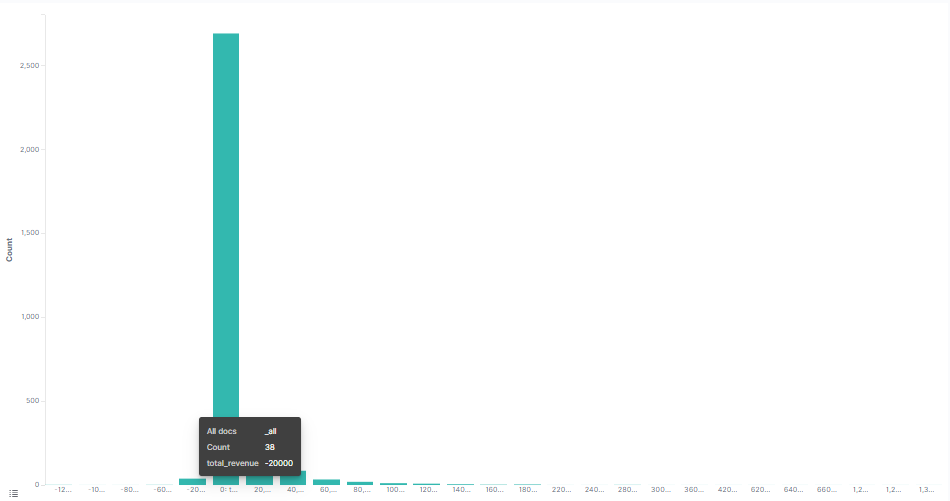
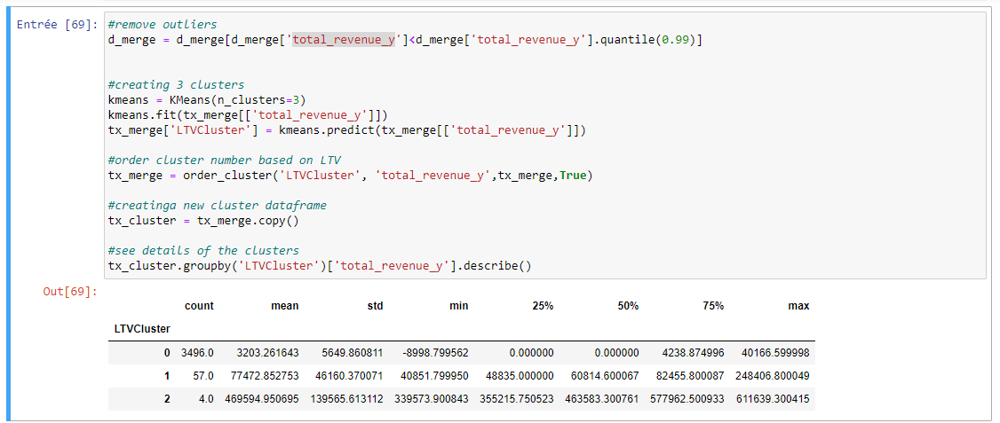

# Part 3: Customer Lifetime Value

In the  [previous article](https://github.com/synapticielfactory/es_analytics/blob/master/README-2.md), we segmented our customers and found out who are the best ones. Now it’s time to measure one of the most important metric we should closely track:  **Customer Lifetime Value.**

We invest in customers (acquisition costs, offline ads, promotions, discounts & etc.) to generate revenue and be profitable. Naturally, these actions make some customers super valuable in terms of lifetime value but there are always some customers who pull down the profitability. We need to identify these behavior patterns, segment customers and act accordingly.

Calculating Lifetime Value is the easy part. First we need to select a time window. It can be anything like 3, 6, 12, 24 months. By the equation below, we can have Lifetime Value for each customer in that specific time window:

> **Lifetime Value**: Total Gross Revenue - Total Cost

This equation now gives us the historical lifetime value. If we see some customers having very high negative lifetime value historically, it could be too late to take an action. At this point, we need to predict the future with machine learning:

**We are going to build a simple machine learning model that predicts our customers lifetime value.**

## Lifetime Value Prediction

We will continue using our  [online retail dataset](https://github.com/synapticielfactory/eland_es_analytics/blob/master/invoices.7z)  for this example as well. Let’s identify our path to glory:

-   Define an appropriate time frame for Customer Lifetime Value calculation
-   Identify the features we are going to use to predict future and create them
-   Calculate lifetime value (LTV) for training the machine learning model
-   Build and run the machine learning model
-   Check if the model is useful

Deciding the time frame really depends on your industry, business model, strategy and more. For some industries, 1 year is a very long period while for the others it is very short. In our example, we will go ahead with  **6 months.**

RFM scores for each customer ID (which we calculated in the  [previous article](https://github.com/synapticielfactory/es_analytics/blob/master/README-2.md)) are the perfect candidates for feature set. To implement it correctly, we need to split our dataset. We will take 3 months of data, calculate RFM and use it for predicting next 6 months. So we need to create two dataframes first and append RFM scores to them.

We have created our RFM scoring and now our feature set looks like below:


I won’t go over the details of RFM scoring as I would be repeating Part 2. you can find all requests in [this link](./src-3/rfm_ltv_requests.txt).

Since our feature set is ready, let’s calculate 6 months LTV for each customer which we are going to use for training our model.

There is no cost specified in the dataset. That’s why Revenue becomes our LTV directly.

This code snippet calculates the LTV and plot its histogram:



Histogram clearly shows we have customers with negative LTV. We have some outliers too. Filtering out the outliers makes sense to have a proper machine learning model.

Ok, next step. We will merge our 3 months and 6 months dataframes to see correlations between LTV and the feature set we have.


The code below merges our feature set and LTV data and plots LTV vs overall RFM score:


you can find the vega script at the following [link](./src-3/correlation_vega_visualisation.txt).

Positive correlation is quite visible here. High RFM score means high LTV.

Before building the machine learning model, we need to identify what is the type of this machine learning problem. LTV itself is a regression problem. A machine learning model can predict the $ value of the LTV. But here, we want LTV segments. Because it makes it more actionable and easy to communicate with other people. By applying K-means clustering, we can identify our existing LTV groups and build segments on top of it.

Considering business part of this analysis, we need to treat customers differently based on their predicted LTV. For this example, we will apply clustering and have 3 segments (number of segments really depends on your business dynamics and goals):

-   Low LTV
-   Mid LTV
-   High LTV

We are going to apply K-means clustering to decide segments and observe their characteristics:

We have finished LTV clustering and here are the characteristics of each clusters:



2 is the best with average 469.5k LTV whereas 0 is the worst with 3.4k

There are few more step before training the machine learning model:

-   Need to do some feature engineering. We should convert categorical columns to numerical columns.
-   We will check the correlation of features against our label, LTV clusters.
-   We will split our feature set and label (LTV) as X and y. We use X to predict y.
-   Will create Training and Test dataset. Training set will be used for building the machine learning model. We will apply our model to Test set to see its real performance.

The code below does it all for us:

```json
PUT /_ingest/pipeline/ltv_segmentation
{
  "description": "",
  "processors": [
    {
      "script": {
        "lang": "painless",
        "source": "if (ctx.OverallScore>1) { ctx.segment_high=1; ctx.segment_low=0; ctx.segment_medium=0} else if(ctx.OverallScore<1) { ctx.segment_low=1; ctx.segment_high=0; ctx.segment_medium=0} else { ctx.segment_medium=1; ctx.segment_high=0; ctx.segment_low=0;}"
      }
    }
  ]
}

POST ml-customers/_update_by_query?pipeline=ltv_segmentation
{
  "query": {
    "match_all": {}
  }
}
```
Let’s start with the requests above.  **PUT /_ingest/pipeline/ltv_segmentation** create ingest that converts categorical columns to 0–1 notations which is executed using the request **POST ml-customers/_update_by_query?pipeline=ltv_segmentation**  . See what it exactly does with the example:


This was our dataset before segmentation. We have one categorical column which is Segment. What happens after applying the earlier segmentation requests:


Segment column is gone but we have new numerical ones which represent it. We have converted it to 3 different columns with 0 and 1 and made it usable for our machine learning model.

Lines related to correlation make us have the data below:
```json
GET ml-customers/_search
{
  "aggs": {
    "statistics": {
      "matrix_stats": {
        "fields": [ "LTVCluster", "recency", "OverallScore", "count_orders_x", "total_revenue_x", "segment_low", "segment_medium", "segment_high"]
      }
    }
  }
}
```
```json
```


We see that 3 months Revenue, Frequency and RFM scores will be helpful for our machine learning models.

Since we have the training and test sets we can build our model.

We used a quite strong ML module from elastic to do the classification for us. It has become a multi classification model since we had 3 groups (clusters).
We access to the ML module and create our job as it is shown in the followings:
```json
{
  "description": "",
  "source": {
    "index": "ml-customers"
  },
  "dest": {
    "index": "ml-customers-out"
  },
  "analyzed_fields": {
    "excludes": [
      "count_orders_y",
      "total_revenue_y"
    ]
  },
  "analysis": {
    "classification": {
      "dependent_variable": "LTVCluster",
      "num_top_feature_importance_values": 2,
      "training_percent": 95
    }
  },
  "model_memory_limit": "60mb"
}
```  


 Let’s look at the initial results :
```json
POST ml-customers-output/_search?size=0
{
  "query": {
    "match_all": {}
  },
  "aggs": {
    "training_accuracy": {
      "scripted_metric": {
        "init_script": "state.samples = []", 
        "map_script": "if(doc['ml.is_training'].value == true){state.samples.add(doc['ml.LTVCluster_prediction'].value == doc.LTVCluster.value ? 1 : 0)}",
        "combine_script": "double correct = 0; double total = 0; for (t in state.samples) { total++; correct += t } return correct/total",
        "reduce_script": "double accuracy = 0; for (a in states) { accuracy += a } return accuracy"
      }
    },
        "test_accuracy": {
      "scripted_metric": {
        "init_script": "state.samples = []", 
        "map_script": "if(doc['ml.is_training'].value == false){state.samples.add(doc['ml.LTVCluster_prediction'].value == doc.LTVCluster.value ? 1 : 0)}",
        "combine_script": "double correct = 0; double total = 0; for (t in state.samples) { total++; correct += t } return correct/total",
        "reduce_script": "double accuracy = 0; for (a in states) { accuracy += a } return accuracy"
      }
    }
  }
}
```


Accuracy shows 98.8% on the test set. Looks really good. Or does it?

First we need to check our benchmark. Biggest cluster we have is cluster 0 which is 98.3% of the total base. If we blindly say, every customer belongs to cluster 0, then our accuracy would be 98.3%.

98.8% vs 98.3% tell us that our machine learning model is a useful one but needs some improvement for sure. We should find out where the model is failing.

We can identify that by looking at classification report:


Precision and recall are acceptable for 0 and 1. As an example, for cluster 1 (Mid LTV), if model tells us  _this customer belongs to cluster 1_, 95 out of 100 will be correct (precision). We really need to improve the model for other clusters. For example, we barely detect 25% of High LTV customers. Possible actions to improve those points:

-   Add more data to the model if possible (specially from third class)
-   Adding more features and improve feature engineering
-   Apply hyper parameter tuning to current model


Great! Now we have a machine learning model which predicts the future LTV segments of our customers. We can easily adapt our actions based on that. For example, we definitely do not want to lose customers with high LTV. So we will focus on Churn Prediction in Part 4.

You can find the jupyter notebook for this part  [here](./src-3/eland_ml_script.ipynb).
