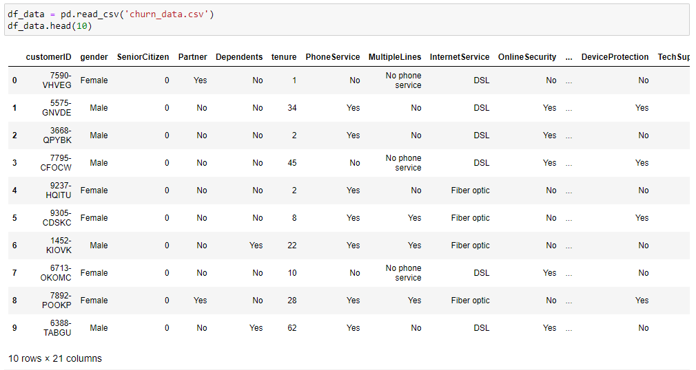
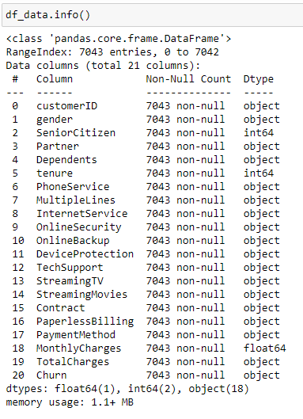

# Part 4: Churn Prediction

In the last three sections of Data Driven Growth series, we have discovered  [tracking essential metrics](https://github.com/synapticielfactory/es_analytics),  [customer segmentation](https://github.com/synapticielfactory/es_analytics/blob/master/README-2.md), and  [predicting the lifetime value](https://github.com/synapticielfactory/es_analytics/blob/master/README-3.md)  programmatically. Since we know our best customers by segmentation and lifetime value prediction, we should also work hard on retaining them. That’s what makes Retention Rate is one of the most critical metrics.

Retention Rate is an indication of how good is your product market fit (PMF). If your PMF is not satisfactory, you should see your customers churning very soon. One of the powerful tools to improve Retention Rate (hence the PMF) is Churn Prediction. By using this technique, you can easily find out who is likely to churn in the given period. In this article, we will use a Telco dataset and go over the following steps to develop a Churn Prediction model:

-   Exploratory data analysis
-   Feature engineering
-   Investigating how the features affect Retention by using Logistic Regression
-   Building a classification model with XGBoost

## Exploratory Data Analysis

We start with checking out how our data looks like and visualize how it interacts with our label (churned or not?). Let’s start with importing our data and print the first ten rows:

df_data = pd.read_csv('churn_data.csv')  
df_data.head(10)

Output:



A better way to see all the columns and their data type is using  **.info()**  method:



It seems like our data fall under two categories:

-   Categorical features: gender, streaming tv, payment method &, etc.
-   Numerical features: tenure, monthly charges, total charges

Now starting from the categorical ones, we shed light on all features and see how helpful they are to identify if a customer is going to churn.

As a side note, in the dataset we have, Churn column is  _string_  with  _Yes/No_ values. We convert it to  _integer_  to make it easier to use in our analysis.
```json
PUT /_ingest/pipeline/churn_labeling
{
  "description": "",
  "processors": [
    {
      "script": {
        "lang": "painless",
        "source": "ctx.churn_flag = ctx.Churn==\"Yes\" ? 1 : 0"
      }
    }
  ]
}

POST es-churn/_update_by_query?pipeline=churn_labeling
{
  "query": {
    "match_all": {}
  }
}
```

**Gender**

By using vertical bar visualization, we easily visualize how Churn Rate (1-Retention Rate)  looks like for each value:

**Churn Rate by Gender**

Gender breakdown for the churn rate:


Female customers are more likely to churn vs. male customers, but the difference is minimal (~0.8%).

**In the same way we do for the following charts:**

Now we go over the features which show the most significant difference across their values:

**Internet Service**


**Churn Rate by Internet Service**

This chart reveals customers who have Fiber optic as Internet Service are more likely to churn. I normally expect Fiber optic customers to churn less due to they use a more premium service. But this can happen due to high prices, competition, customer service, and many other reasons.

**Contract**


**Churn Rate by Contract**

As expected, the shorter contract means higher churn rate.

**Tech Support**


**Churn Rate by Tech Support**

Customers don’t use Tech Support are more like to churn (~25% difference).

**Payment Method**


Automating the payment makes the customer more likely to retain in your platform (~30% difference).

**Others**

Let’s show some of the other features’ graphs here for the reference:


**Churn Rate by Paperless Billing, Streaming Movies, Device Protection & Phone Service**

We are done with the categorical features. Let’s see how numerical features look like:

**Tenure**

To see the trend between Tenure and average Churn Rate, let’s make a scatter plot:


**Churn Rate by Tenure**

Super apparent that the higher tenure means lower Churn Rate. We are going to apply the same for  _Monthly and Total Charges:_

Output:


**Churn Rate by Monthly & Total Charges**

Unfortunately, there is no trend between Churn Rate and Monthly & Total Charges.

## Feature Engineering

In this section, we are going to transform our raw features to extract more information from them. Our strategy is as follows:

1- Group the numerical columns by using clustering techniques

2- Encoding categorical features which are binary with **label encoder**

3- Categorizing features which have multiple values

**Numerical Columns**

As we know from the EDA section, We have three numerical columns:

-   Tenure
-   Monthly Charges
-   Total Charges

We are going to apply the following steps to create groups:

1.  Using Elbow Method to identify the appropriate number of clusters
2.  Applying K-means logic to the selected column and change the naming
3.  Observe the profile of clusters

Let’s check how this works for  _Tenure_  in practice:

Cluster profiles:


We have 3 clusters with 7.5, 33.9 and 63 as their average Tenure.

Churn Rate for each cluster:


**Churn Rate by tenure clusters**

This is how it looks after applying the same for Monthly & Total Charges:

_Monthly Charge:_


**Monthly Charge Clusters profile**


**Churn Rate by monthly charge clusters**

_Total Charge:_


**Total Charge Clusters profile**


**Churn Rate by total charge clusters**

**Categorical Columns**

**Label Encoder** converts categorical columns to numerical by simply assigning integers to distinct values. For instance, the column  **gender** has two values:  _Female_  &  _Male_. Label encoder will convert it to 1 and 0.

**get_dummies()** method creates new columns out of categorical ones by assigning 0 & 1s. for example, for TenureCluster we will have 3 columns that takes two values 0 or 1 as follows :

- TenureCluster_Low
- TenureCluster_Mid
- TenureCluster_High

Let’s see both in practice:
```python
#import Label Encoder  
from sklearn.preprocessing import LabelEncoder  
le = LabelEncoder()  
dummy_columns = [] #array for multiple value columnsfor column in df_data.columns:  
    if df_data[column].dtype == object and column != 'customerID':  
        if df_data[column].nunique() == 2:  
            #apply Label Encoder for binary ones  
            df_data[column] = le.fit_transform(df_data[column])   
        else:  
            dummy_columns.append(column)#apply get dummies for selected columns  
df_data = pd.get_dummies(data = df_data,columns = dummy_columns)
```

Check out how the data looks like for the selected columns:


As you can see easily,  **gender** &  **Partner** columns became numerical ones, and we have three new columns for  **TenureCluster**.

It is time to fit a logistic regression model and extract insights to make better business decisions.


## Logistic Regression

Predicting churn is a binary classification problem.  Customers either churn or retain in a given period. Along with being a robust model, Logistic Regression provides interpretable outcomes too. As we did before, let’s sort out our steps to follow for building a Logistic Regression model:

1.  Prepare the data (inputs for the model)
2.  Fit the model and see the model summary

And the summary looks like below:

)

We have two important outcomes from this report. When you prepare a Churn Prediction model, you will face with the questions below:

1- Which characteristics make customers churn or retain?

2- What are the most critical ones? What should we focus on?

For the first question, you should look at the 4th column (P>|z|). If the absolute  **p-value** is smaller than 0.05, it means, that feature affects Churn in a statistically significant way. Examples are:

-   SeniorCitizen
-   InternetService_DSL
-   OnlineSecurity_NO

Then the second question. We want to reduce the Churn Rate, where we should start? The scientific version of this question is;

> Which feature will bring the best ROI if I increase/decrease it by one unit?

That question can be answered by looking at the  **coef**  column. Exponential  **coef** gives us the expected change in Churn Rate if we change it by one unit. If we apply the code below, we will see the transformed version of all coefficients:

np.exp(res.params)


As an example, one unit change in Monthly Charge means ~3.4% improvement in the odds for churning if we keep everything else constant. From the table above, we can quickly identify which features are more important.

Now, everything is ready for building our classification model.

## Binary Classification Model with Data frame analytics in ElasticSearch

To fit Data frame analytics to our data, we should prepare features (X) and label(y) sets and do the train & test split.

To do so, let's create new job :

```json
PUT _ml/data_frame/analytics/churn_analysis
{
  "description": "",
  "source": {
    "index": "es-churn"
  },
  "dest": {
    "index": "ml-churn-output"
  },
  "analyzed_fields": {
    "excludes": [
      "customerID"
    ]
  },
  "analysis": {
    "classification": {
      "dependent_variable": "Churn",
      "num_top_feature_importance_values": 10000,
      "training_percent": 95
    }
  },
  "model_memory_limit": "89mb"
}
```
To start the analysis we use the following command : 
```
POST _ml/data_frame/analytics/churn_analysis/_start
```

ML module use automatic [feature encoding](https://www.elastic.co/guide/en/machine-learning/7.10/ml-feature-encoding.html) for all categorical features which allows to process our features as we did in **Feature Engineering** section. However, it is allowed to define costume Feature Labelling. To do so we set the parameter as in following query : 

```json
PUT _ml/data_frame/analytics/churn_analysis_sofisticated
{
  "description": "",
  "source": {
    "index": "es-churn"
  },
  "dest": {
    "index": "ml-churn-output-s"
  },
  "analyzed_fields": {
    "excludes": [
      "customerID",
      "churn_flag"
    ]
  },
  "analysis": {
    "classification": {
      "dependent_variable": "Churn",
      "num_top_feature_importance_values": 10000,
      "training_percent": 95,
      "feature_processors": [
        {
          "one_hot_encoding":  {
            "field":  "gender",
            "hot_map":  {
              "Male":  "gender_Male",
              "Female":  "gender_Female"
             }
          }
        },
        {
          "one_hot_encoding":  {
            "field":  "DeviceProtection",
            "hot_map":  {
              "Yes":  "DeviceProtection_Yes",
              "No":  "DeviceProtection_No"
             }
          }
        },
      ]
    }
  },
  "model_memory_limit": "89mb"
}
```

query for accuracy : 
```json
POST es-churn-output/_search?size=0
{
  "query": {
    "match_all": {}
  },
  "aggs": {
    "training_accuracy": {
      "scripted_metric": {
        "init_script": "state.samples = []", 
        "map_script": "if(doc['ml.is_training'].value == true){state.samples.add(doc['ml.Churn_prediction'].value == doc.Churn.value ? 1 : 0)}",
        "combine_script": "double correct = 0; double total = 0; for (t in state.samples) { total++; correct += t } return correct/total",
        "reduce_script": "double accuracy = 0; for (a in states) { accuracy += a } return accuracy"
      }
    },
    "test_accuracy": {
      "scripted_metric": {
        "init_script": "state.samples = []", 
        "map_script": "if(doc['ml.is_training'].value == false){state.samples.add(doc['ml.Churn_prediction'].value == doc.Churn.value ? 1 : 0)}",
        "combine_script": "double correct = 0; double total = 0; for (t in state.samples) { total++; correct += t } return correct/total",
        "reduce_script": "double accuracy = 0; for (a in states) { accuracy += a } return accuracy"
      }
    }
  }
}
```

By using this simple model, we have achieved 80% accuracy:


Our actual Churn Rate in the dataset was 26.5% (reflects as 73.5% for model performance). This shows our model is a useful one. Better to check our classification model to see where exactly our model fails.


```json
POST es-churn-output/_search?size=0
{
  "query": {
    "match": {
      "ml.is_training": true
    }
  },
  "aggs": {
        "precision_0": {
      "scripted_metric": {
        "init_script": "state.samples = []", 
        "map_script": "if(doc['ml.Churn_prediction'].value == doc.Churn.value){state.samples.add( doc.Churn.value == 0 ? 1 : 0)}",
        "combine_script": "double correct = 0; double total = 0; for (t in state.samples) { total++; correct += t } return correct/total",
        "reduce_script": "double accuracy = 0; for (a in states) { accuracy += a } return accuracy"
      }
    },
    "precision_1": {
      "scripted_metric": {
        "init_script": "state.samples = []", 
        "map_script": "if(doc['ml.Churn_prediction'].value == doc.Churn.value){state.samples.add( doc.Churn.value == 1 ? 1 : 0)}",
        "combine_script": "double correct = 0; double total = 0; for (t in state.samples) { total++; correct += t } return correct/total",
        "reduce_script": "double accuracy = 0; for (a in states) { accuracy += a } return accuracy"
      }
    },
    "recall_0": {
      "scripted_metric": {
        "init_script": "state.samples = []", 
        "map_script": "if(doc.Churn.value == 0){state.samples.add(  doc['ml.Churn_prediction'].value == doc.Churn.value ? 1 : 0)}",
        "combine_script": "double correct = 0; double total = 0; for (t in state.samples) { total++; correct += t } return correct/total",
        "reduce_script": "double accuracy = 0; for (a in states) { accuracy += a } return accuracy"
      }
    },
    "recall_1": {
      "scripted_metric": {
        "init_script": "state.samples = []", 
        "map_script": "if(doc.Churn.value == 1){state.samples.add(  doc['ml.Churn_prediction'].value == doc.Churn.value ? 1 : 0)}",
        "combine_script": "double correct = 0; double total = 0; for (t in state.samples) { total++; correct += t } return correct/total",
        "reduce_script": "double accuracy = 0; for (a in states) { accuracy += a } return accuracy"
      }
    }
  }
}
```


We can interpret the report above as if our model tells us, 100 customers will churn, 26 of it will churn (0.26 precision). And actually, there are around 128 customers who will churn (0.78 recall). Especially recall is the main problem here, and we can improve our model’s overall performance by:

-   Adding more data (we have around 2k rows for this example)
-   Adding more features
-   More feature engineering
-   Trying other models
-   Hyper-parameter tuning

Moving forward, let’s see how our model works in detail. First off, we want to know which features our model exactly used from the dataset. Also, which were the most important ones?

For addressing this question, we can use the feature importance section chart:


**Features importance for Classification Model**

We can see that our model assigned more importance to  **Contract** and  **tenure** compared to others.

Finally, the best way to use this model is assigning Churn Probability for each customer, create segments, and build strategies on top of that. To get the churn probability from our model, consult the report as below:


Churn Probabilities of the customers

or use the following query : 
```
POST es-churn-output/_search
{
  "query": {
    "match_all": {}
  },
  "fields": ["customerID", "ml.prediction_probability"],
  "_source": false
}
```
