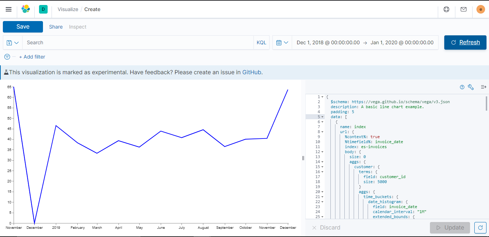

# Learn what and how to track with Python (Eland) and Elasticsearch

> This series of article was inspired from [Barış Karaman](https://towardsdatascience.com/@karamanbk), and the objectif is to adapt the content to the context of Elasticsearch.

## Introduction
This series of articles was designed to explain how to use [Eland]() and [Elasticsearch]() in a simplistic way to fuel your company’s growth by applying the predictive approach to all your actions. It will be a combination of programming, data analysis, and machine learning.
I will cover all the topics in the following 9 articles :

1. Know Your Metrics
2. [Customer Segmentation](README-2.md)
3. Customer Lifetime Value Prediction
4. Churn Prediction
5. Predicting Next Purchase Day
6. Predicting Sales
7. Market Response Models
8. Uplift Modeling
9. A/B Testing Design and Execution

Articles will have their own code snippets to make you easily apply them. If you are super new to programming, you can have a good introduction for Eland and Pandas [here](https://github.com/synapticielfactory/eland_es_analytics).

But still without a coding introduction, you can learn the concepts, how to use your data and start generating value out of it:

> Sometimes you gotta run before you can walk — Tony Stark

As a pre-requisite, be sure `Jupyter Notebook`, `Python` and `Elasticsearch` are installed on your computer. The code snippets will run on Jupyter Notebook only.
Alright, let’s start.

# Part 1: Know Your Metrics

We all remember Captain Sparrow’s famous compass that shows the location of what he wants the most. Without a `North Star Metric`, this is how we are in terms of growth. We want more customers, more orders, more revenue, more signups, more efficiency ...

Before going into coding, we need to understand what exactly is `North Star Metric`. If you already know and track it, this post can help you do a deep dive analysis with Eland and Elasticsearch. If you don’t know, first you should find yours (probably you are already tracking it but didn’t name it as `North Star` conceptually). This is how Sean Ellis describes it :

> The `North Star Metric` is the single metric that best captures the core value that your product delivers to customers.

This metric depends on your company’s product, position, targets & more. `Airbnb’s North Star Metric` is nights booked whereas for Facebook, it is daily active users.

In our example, we will be using a sample dataset of an [online devices retail](https://github.com/synapticielfactory/eland_es_analytics/blob/master/invoices.7z). For an online retail, we can select our `North Star Metric` as `Monthly Revenue`. Let’s see how our data look like.

## Monthly Revenue

> Read this [article](https://github.com/synapticielfactory/eland_es_analytics) to undestand how eland work with elasticsearch and how to load the datatset quickly into elasticsearch

Let’s start with importing the libraries we need and reading our data from Elasticsearch with the help of eland:

```python
# import eland official API
# check it on https://github.com/elastic/eland
import eland as ed

# other imports
import pandas as pd
import matplotlib.pyplot as plt

# import elasticsearch-py client
from elasticsearch import Elasticsearch

# Function for pretty-printing JSON
def json(raw):
    import json
    print(json.dumps(raw, indent=2, sort_keys=True))

# Connect to an Elasticsearch instance
# here we use the official Elastic Python client
# check it on https://github.com/elastic/elasticsearch-py
es = Elasticsearch(
  ['http://localhost:9200'],
  http_auth=("es_kbn", "changeme")
)
# print the connection object info (same as visiting http://localhost:9200)
# make sure your elasticsearch node/cluster respond to requests
json(es.info())

ed_df = ed.read_es(es, 'es-invoices')
# Shape is determined by using count API
ed_df.shape
# Show a sample
ed_df.head()

```

This is how our data looks like inside `es-invoices` elasticsearch index :


```json
{
  "invoice_id": "553464",
  "item_id": "35310308",
  "item_model": "SM-J110H/DS",
  "item_name": "Samsung SM-J110H/DS",
  "item_brand": "Samsung",
  "item_vendor": "Samsung Korea",
  "invoice_date": "2019-05-17T11:07:00",
  "order_qty": 12,
  "unit_price": 16.5,
  "revenue": 198,
  "customer_id": "16218",
  "country_name": "Morocco",
  "country_location": "31.791702,-7.09262"
}
```
You can use this `update_by_query` to compute the total ammount per order as it's not calculated in the original dataset

```json
POST es-invoices/_update_by_query?refresh=false&wait_for_completion=false
{
  "script": {
    "source": "ctx._source['revenue'] = ctx._source['unit_price'] * ctx._source['order_qty']"
  }
}
```
Then use [Task API](https://www.elastic.co/guide/en/elasticsearch/reference/current/tasks.html) to track the progress of your query

```
GET /_tasks
```

We have all the crucial information we need:

- Customer ID
- Unit Price
- Quantity
- Invoice Date


With all these features, we can build our `North Star Metric` equation:

> `Revenue = Active Customer Count * Order Count * Average Revenue per Order`

It’s time to get our hands dirty. We want to see monthly revenue but unfortunately there is no free lunch. Let’s engineer our data:

For this purpose we will use [Tranform](https://www.elastic.co/guide/en/elasticsearch/reference/current/transforms.html) to summarize the data and prepare a simple DataFrame.

This is an example of tranform used to summarize the data and get the DataFrame required for our Monthly analysis

```json
PUT _transform/es-invoices-summary{
  "id": "es-invoices-summary",
  "source": {
    "index": ["es-invoices"],
    "query": {
      "match_all": {}
    }
  },
  "dest": {
    "index": "es-invoices-summary"
  },
  "pivot": {
    "group_by": {
      "invoice_date": {
        "date_histogram": {
          "field": "invoice_date",
          "calendar_interval": "1M"
        }
      }
    },
    "aggregations": {
      "customer_cardinality": {
        "cardinality": {
          "field": "customer_id"
        }
      },
      "avg_revenue": {
        "avg": {
          "field": "revenue"
        }
      },
      "total_revenue": {
        "sum": {
          "field": "revenue"
        }
      },
      "quantity": {
        "sum": {
          "field": "order_qty"
        }
      }
    }
  }
}
```


Next step, visualization. A line graph would be sufficient:


This clearly shows our revenue is growing especially Aug ‘2019 onwards (and our data in December is incomplete). Absolute numbers are fine, let’s figure out what is our `Monthly Revenue Growth Rate`:


Everything looks good, we saw 26.8% growth previous month (December is excluded in the code since it hasn’t been completed yet). But we need to identify what exactly happened on April. Was it due to less active customers or our customers did less orders ? Maybe they just started to buy cheaper products ? We can’t say anything without doing a deep-dive analysis.

## Monthly Active Customers

To see the details `Monthly Active Customers`, we will follow the steps we exactly did for `Monthly Revenue`. We can get the monthly active customers by counting unique CustomerIDs.


In April, Monthly Active Customer number dropped to 944 from 1082 (-12.75%).
We will see the same trend for number of orders as well.

## Monthly Order Count

We will apply the same code by using Quantity field:


As we expected, Order Count is also declined in April (351k to 289k, -17,87%)
We know that Active Customer Count directly affected Order Count decrease. At the end, we should definitely check our Average Revenue per Order as well.

## Average Revenue per Order

To get this data, we need to calculate the average of revenue for each month:


Even the monthly order average dropped for April 185.9 to 164,8). We observed slow-down in every metric affecting our North Star.

We have looked at our major metrics. Of course there are many more and it varies across industries. Let’s continue investigating some other important metrics:

- New Customer Ratio : a good indicator of if we are losing our existing customers or unable to attract new ones

- Retention Rate : King of the metrics. Indicates how many customers we retain over specific time window.

We will be showing examples for monthly retention rate and cohort based retention rate.

## New Customer Ratio

First we should define what is a new customer. In our dataset, we can assume a new customer is whoever did his/her first purchase in the time window we defined. We will do it monthly for this example.

We will be using a new `tranform`  to find our first purchase date for each customer and define new customers based on that, then an `enrich policy` can be used to update our dataset

The code below will apply this function and show us the revenue breakdown for each group monthly.

Here is the transform that find our first purchase date for each customer and other metrics.

```json
PUT _transform/es-invoices-customers
{
  "id": "es-invoices-customers",
  "source": {
    "index": ["es-invoices"],
    "query": {
      "match_all": {}
    }
  },
  "dest": {
    "index": "es-invoices-customers"
  },
  "pivot": {
    "group_by": {
      "customer_id": {
        "terms": {
          "field": "customer_id"
        }
      }
    },
    "aggregations": {
      "avg_revenue": {
        "avg": {
          "field": "revenue"
        }
      },
      "total_revenue": {
        "sum": {
          "field": "revenue"
        }
      },
      "first_invoice": {
        "min": {
          "field": "invoice_date"
        }
      },
      "last_invoice": {
        "max": {
          "field": "invoice_date"
        }
      },
      "count_orders": {
        "value_count": {
          "field": "invoice_id"
        }
      },
      "quantity": {
        "sum": {
          "field": "order_qty"
        }
      }
    }
  }
}
```
```
# start the transformation so we can use them later
POST _transform/es-invoices-customers/_start
```

Now let's define an enrich poilicy that will be used to update the original index `es-invoices` with the customer first sales date from the new index `es-invoices-customers`

```json
# Enrichment policy for customer first sales date
PUT /_enrich/policy/customer_first_order_date
{
  "match": {
    "indices": "es-invoices-customers",
    "match_field": "customer_id",
    "enrich_fields": [
      "first_invoice"
    ]
  }
}
```

```
# Execute the policy so we can populate with the first sales date
POST /_enrich/policy/customer_first_order_date/_execute
```

```json
# Our enrichment pipeline for adding first sales date
PUT _ingest/pipeline/customer_first_order_date
{
  "description": "Adds customer first sales order date by customer_id",
  "processors": [
    {
      "enrich": {
        "policy_name": "customer_first_order_date",
        "field": "customer_id",
        "target_field": "enrich", 
        "max_matches": 1
      }
    },
    {
      "rename": {
        "field": "enrich.first_invoice",
        "target_field": "first_invoice",
        "ignore_failure": true
      }
    },
    {
      "remove": {
        "field": "enrich",
        "ignore_failure": true
      }
    }
  ]
}
```
Everything is in place, all we need is to update our dataset

```json
POST es-invoices/_update_by_query?pipeline=customer_first_order_date&wait_for_completion=false
{
  "query": {
    "match_all": {}
  }
}
```

Then we need a second update to differentiate existing customer from new one's

```json
POST es-invoices/_update_by_query?wait_for_completion=false
{
  "query": {
    "bool": {
      "must": [
        {
          "exists": {
            "field": "first_invoice"
          }
        }
      ]
    }
  },"script": {
    "source": """
    long invoice_date = new SimpleDateFormat("yyyy-MM-dd'T'hh:mm:ss").parse(ctx._source['invoice_date']).getTime();
    
    long first_invoice = new SimpleDateFormat("yyyy-MM-dd'T'hh:mm:ss").parse(ctx._source['first_invoice']).getTime();
    
    
    
    if ( invoice_date > first_invoice ) {ctx._source['customer_type'] = 'Existing Customer'} else { ctx._source['customer_type'] = 'New Customer'}
    
    """,
    "lang": "painless"
  }
}
```

The final result of our dataset should looks like this
```json
{
  "customer_type": "Existing Customer",
  "item_id": "35430608",
  "country_location": "31.791702,-7.09262",
  "item_name": "Samsung SM-G610F/DD",
  "order_qty": 16,
  "unit_price": 14.5,
  "item_brand": "Samsung",
  "invoice_date": "2019-07-21T12:25:00.000Z",
  "first_invoice": "2018-12-14T12:59:00.000Z",
  "item_model": "SM-G610F/DD",
  "revenue": 232,
  "item_vendor": "Samsung Korea",
  "country_name": "Morocco",
  "invoice_id": "560841",
  "customer_id": "14298"
}
```


Existing customers are showing a positive trend and tell us that our customer base is growing but new customers have a slight negative trend.

Let’s have a better view by looking at the New Customer Ratio :


New Customer Ratio has declined as expected (we assumed on Feb, all customers were New) and running around 20%.

## Monthly Retention Rate

Retention rate should be monitored very closely because it indicates how sticky is your service and how well your product fits the market. For making Monthly Retention Rate visualized, we need to calculate how many customers retained from previous month.

> **Monthly Retention Rate** = Retained Customers From Prev. Month/Active Customers Total

For this task, we will take advantage of the strength of Vega extension in Kibana.

Vega is a tool that allows to build custom visualizations backed by one or multiple data sources. One of it's main features, it offers a collection of transformations tools which enables processing input data just before visualization.


First, we will create aggregation that shows monthly retention of each costumer as the following : 
```json
GET es-invoices/_search
{
  "query": {
    "match_all": {}
  },
  "aggs": {
  "customer": {
    "terms": {
      "field": "customer_id",
      "size" : 9999
    },
    "aggs": {
      "hist": {
        "date_histogram": {
          "field": "invoice_date",
          "calendar_interval": "1M",
          "min_doc_count": 0
        },
        "aggs": {
          "card": {
            "cardinality": {
              "field": "customer_id"
            }
          },
          "derv": {
            "derivative": {
              "buckets_path": "card",
              "gap_policy": "insert_zeros"
            }
          },
          "retention": {
            "bucket_script": {
              "buckets_path": {
                "derv": "derv",
                "card": "card"
              },
              "script": "if(params.derv == 0 && params.card == 1) { return 1 } else { return 0 }",
              "gap_policy": "insert_zeros"
            }
          }
        }
      }
    }
  }
}
}
```
Therefore, we used cardinality aggregation as costumer activity indicator and relied on derivative aggregation to measure retention of a costumer for each month.

Then, we create a new Vega visualization form Kibana where we will use our aggregation. Vega visualization takes as configuration a json script that is in the right. The general structure of the config is as follows :
 ```
 {
  "$schema": "https://vega.github.io/schema/vega-lite/v2.json",
  "title": "Event counts from all indexes",
  "data": [{...}, ...],
  "scales": [{...}, ...],
  "axes": [{...}, ...],
  "marks": [{...}, ...]
}
```
This config is made up of 4 mainly attributes :
 - **data** set definitions and transforms define the data to load and how to process it.
 - **scales** map data values (numbers, dates, categories, _etc._) to visual values (pixels, colors, sizes).
 - **axes** visualize spatial [scale](https://vega.github.io/vega/docs/scales) mappings using ticks, grid lines and labels.
 - **marks** are graphic visual that encodes data using geometric primitives such as rectangles, lines, and plotting symbols.

Now we will take advantage of the Vega's transform feature extension to get retention of all users, active users and then Retention Rate. To do so, we just need to define our transformation **retention_data** for the earlier aggregation **es_data** in **data** section :
 ```Hjson
  data: [
    {
      name: es_data
      url: {
        %context%: true
        %timefield%: invoice_date
        index: es-invoices
        body: {
          size: 0
          aggs: {
            customer: {
              terms: {
                field: customer_id
                size: 5000
              }
              aggs: {
                time_buckets: {
                  date_histogram: {
                    field: invoice_date
                    calendar_interval: "1M"
                    extended_bounds: {
                      min: {
                        %timefilter%: min
                      }
                      max: {
                        %timefilter%: max
                      }
                    }
                    min_doc_count: 0
                  }
                  aggs: {
                    card: {
                      cardinality: {
                        field: customer_id
                      }
                    }
                    derv: {
                      derivative: {
                        buckets_path: card
                        gap_policy: insert_zeros
                      }
                    }
                    retention: {
                      bucket_script: {
                        buckets_path: {
                          derv: derv
                          card: card
                        }
                        script: if(params.derv == 0 && params.card == 1) { return 1 } else { return 0 }
                        gap_policy: insert_zeros
                      }
                    }
                  }
                }
              }
            }
          }
        }
      }
      format: {
        property: aggregations.customer.buckets
      }
    }
    {
      name: retention_data
      source: index
      transform: [
        {
          type: flatten
          fields: [
            time_buckets.buckets
          ]
          as: [
            histogram
          ]
        }
        {
          type: aggregate
          fields: [
            histogram.retention.value
            histogram.card.value
          ]
          ops: [
            sum
            sum
          ]
          as: [
            user_retention
            user_count
          ]
          groupby: [
            histogram.key
          ]
        }
        {
          type: formula
          as: retention_ratio
          expr: datum.user_retention*100/datum.user_count
        }
      ]
    }
  ]
```

Also, we need a visual configuration that can be set as below: 
 ```Hjson
  scales: [
    {
      name: x
      type: time
      range: width
      domain: {
        data: retention_data
        field: histogram\.key
      }
      nice: {"interval": "day", "step": 1}
    }
    {
      name: y
      type: linear
      range: height
      nice: true
      zero: true
      domain: {
        data: retention_data
        field: retention_ratio
      }
    }
  ]
  axes: [
    {
      orient: bottom
      scale: x
    }
    {
      orient: left
      scale: y
    }
  ]
  marks: [
    {
      type: line
      from: {
        data: retention_data
      }
      encode: {
        enter: {
          x: {
            scale: x
            type: temporal
            field: histogram\.key
          }
          y: {
            scale: y
            type: quantitive
            field: retention_ratio
          }
          stroke: {
            value: "#00f"
          }
        }
      }
    }
  ]
```

In the end, we have our Retention Rate & line chart like below:


## Cohort Based Retention Rate
There is another way of measuring Retention Rate which allows you to see Retention Rate for each cohort. Cohorts are determined as first purchase year-month of the customers. We will be measuring what percentage of the customers retained after their first purchase in each month. This view will help us to see how recent and old cohorts differ regarding retention rate and if recent changes in customer experience affected new customer’s retention or not.

For this aim, we have used our cohort visualization plugin that can be found in the following repository [kibana_cohor](https://github.com/synapticielfactory/kibana_cohort). Once installed, we can find it amoung other visualisations in Kibana>visualize>cohort.

In order to config Cohort visualisation we need to provide 3 aggregations :
 - cohort metric
 - cohort date
 - cohort period

Following our study, our metric would be the sum of active customers. while cohort date would be their first purchase.
To get the cohort period we need to create a new scripted field. Go to Stack Management>Index patterns>"es-invoices" and create a new scripted field with the following source: 
```json
(doc['invoice_date'].value.toInstant().toEpochMilli() - doc['first_invoice'].value.toInstant().toEpochMilli()) / 86400000
```
Therefore we got our cohort visualization :

