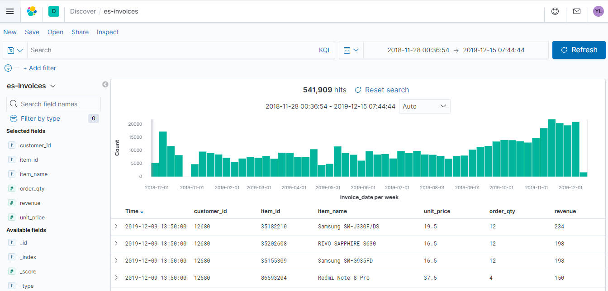
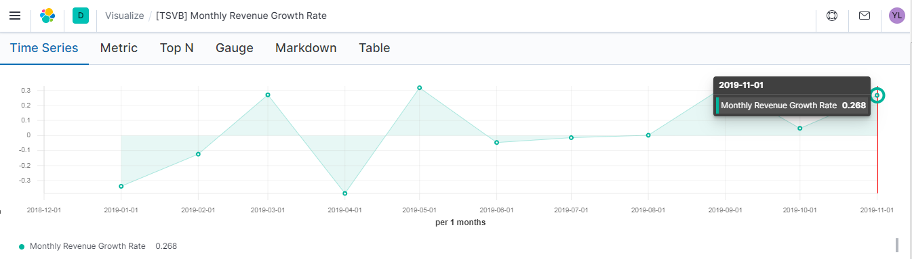

# Learn what and how to track with Python (Eland) and Elasticsearch

> This series of article was inspired from [Barış Karaman](https://towardsdatascience.com/@karamanbk), and the objectif is to adapt the content to the context of Elasticsearch.

## Introduction
This series of articles was designed to explain how to use [Eland]() and [Elasticsearch]() in a simplistic way to fuel your company’s growth by applying the predictive approach to all your actions. It will be a combination of programming, data analysis, and machine learning.
I will cover all the topics in the following 9 articles :

1. Know Your Metrics
2. Customer Segmentation
3. Customer Lifetime Value Prediction
4. Churn Prediction
5. Predicting Next Purchase Day
6. Predicting Sales
7. Market Response Models
8. Uplift Modeling
9. A/B Testing Design and Execution

Articles will have their own code snippets to make you easily apply them. If you are super new to programming, you can have a good introduction for Eland and Pandas [here](https://github.com/synapticielfactory/eland_es_analytics).

But still without a coding introduction, you can learn the concepts, how to use your data and start generating value out of it:

> Sometimes you gotta run before you can walk — Tony Stark

As a pre-requisite, be sure `Jupyter Notebook`, `Python` and `Elasticsearch` are installed on your computer. The code snippets will run on Jupyter Notebook only.
Alright, let’s start.

# Part 1: Know Your Metrics

We all remember Captain Sparrow’s famous compass that shows the location of what he wants the most. Without a `North Star Metric`, this is how we are in terms of growth. We want more customers, more orders, more revenue, more signups, more efficiency ...

Before going into coding, we need to understand what exactly is `North Star Metric`. If you already know and track it, this post can help you do a deep dive analysis with Eland and Elasticsearch. If you don’t know, first you should find yours (probably you are already tracking it but didn’t name it as `North Star` conceptually). This is how Sean Ellis describes it :

> The `North Star Metric` is the single metric that best captures the core value that your product delivers to customers.

This metric depends on your company’s product, position, targets & more. `Airbnb’s North Star Metric` is nights booked whereas for Facebook, it is daily active users.

In our example, we will be using a sample dataset of an [online devices retail](https://github.com/synapticielfactory/eland_es_analytics/blob/master/invoices.7z). For an online retail, we can select our `North Star Metric` as `Monthly Revenue`. Let’s see how our data look like.

## Monthly Revenue

> Read this [article](https://github.com/synapticielfactory/eland_es_analytics) to undestand how eland work with elasticsearch and how to load the datatset quickly into elasticsearch

Let’s start with importing the libraries we need and reading our data from Elasticsearch with the help of eland:

```python
# import eland official API
# check it on https://github.com/elastic/eland
import eland as ed

# other imports
import pandas as pd
import matplotlib.pyplot as plt

# import elasticsearch-py client
from elasticsearch import Elasticsearch

# Function for pretty-printing JSON
def json(raw):
    import json
    print(json.dumps(raw, indent=2, sort_keys=True))

# Connect to an Elasticsearch instance
# here we use the official Elastic Python client
# check it on https://github.com/elastic/elasticsearch-py
es = Elasticsearch(
  ['http://localhost:9200'],
  http_auth=("es_kbn", "changeme")
)
# print the connection object info (same as visiting http://localhost:9200)
# make sure your elasticsearch node/cluster respond to requests
json(es.info())

ed_df = ed.read_es(es, 'es-invoices')
# Shape is determined by using count API
ed_df.shape
# Show a sample
ed_df.head()

```

This is how our data looks like inside `es-invoices` elasticsearch index :


```json
{
  "invoice_id": "553464",
  "item_id": "35310308",
  "item_model": "SM-J110H/DS",
  "item_name": "Samsung SM-J110H/DS",
  "item_brand": "Samsung",
  "item_vendor": "Samsung Korea",
  "invoice_date": "2019-05-17T11:07:00",
  "order_qty": 12,
  "unit_price": 16.5,
  "revenue": 198,
  "customer_id": "16218",
  "country_name": "Morocco",
  "country_location": "31.791702,-7.09262"
}
```

We have all the crucial information we need:

- Customer ID
- Unit Price
- Quantity
- Invoice Date




With all these features, we can build our `North Star Metric` equation:

> `Revenue = Active Customer Count * Order Count * Average Revenue per Order`

It’s time to get our hands dirty. We want to see monthly revenue but unfortunately there is no free lunch. Let’s engineer our data:

For this purpose we will use [Tranform](https://www.elastic.co/guide/en/elasticsearch/reference/current/transforms.html) to summarize the data and prepare a simple DataFrame.

This is an example of tranform used to summarize the data and get the DataFrame required for our Monthly analysis

```json
{
  "id": "es-invoices-summary",
  "source": {
    "index": ["es-invoices"],
    "query": {
      "match_all": {}
    }
  },
  "dest": {
    "index": "es-invoices-summary"
  },
  "pivot": {
    "group_by": {
      "invoice_date": {
        "date_histogram": {
          "field": "invoice_date",
          "calendar_interval": "1M"
        }
      }
    },
    "aggregations": {
      "customer_cardinality": {
        "cardinality": {
          "field": "customer_id"
        }
      },
      "avg_revenue": {
        "avg": {
          "field": "revenue"
        }
      },
      "total_revenue": {
        "sum": {
          "field": "revenue"
        }
      },
      "quantity": {
        "sum": {
          "field": "order_qty"
        }
      }
    }
  }
}
```


Next step, visualization. A line graph would be sufficient:


This clearly shows our revenue is growing especially Aug ‘2019 onwards (and our data in December is incomplete). Absolute numbers are fine, let’s figure out what is our `Monthly Revenue Growth Rate`:



Everything looks good, we saw 26.8% growth previous month (December is excluded in the code since it hasn’t been completed yet). But we need to identify what exactly happened on April. Was it due to less active customers or our customers did less orders ? Maybe they just started to buy cheaper products ? We can’t say anything without doing a deep-dive analysis.

## Monthly Active Customers

To see the details `Monthly Active Customers`, we will follow the steps we exactly did for `Monthly Revenue`. We can get the monthly active customers by counting unique CustomerIDs.


In April, Monthly Active Customer number dropped to 944 from 1082 (-12.75%).
We will see the same trend for number of orders as well.

## Monthly Order Count

We will apply the same code by using Quantity field:


As we expected, Order Count is also declined in April (351k to 289k, -17,87%)
We know that Active Customer Count directly affected Order Count decrease. At the end, we should definitely check our Average Revenue per Order as well.

## Average Revenue per Order

To get this data, we need to calculate the average of revenue for each month:


Even the monthly order average dropped for April 185.9 to 164,8). We observed slow-down in every metric affecting our North Star.

We have looked at our major metrics. Of course there are many more and it varies across industries. Let’s continue investigating some other important metrics:

- New Customer Ratio : a good indicator of if we are losing our existing customers or unable to attract new ones

- Retention Rate : King of the metrics. Indicates how many customers we retain over specific time window.

We will be showing examples for monthly retention rate and cohort based retention rate.

## New Customer Ratio

First we should define what is a new customer. In our dataset, we can assume a new customer is whoever did his/her first purchase in the time window we defined. We will do it monthly for this example.

We will be using .min() function to find our first purchase date for each customer and define new customers based on that.

The code below will apply this function and show us the revenue breakdown for each group monthly.